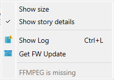

# Lunii.QT
A Python QT app to manage Lunii Storyteller, including **reorder** / **import** / **export** / **firmware download**   
for Windows / Linux / MacOs 11  
(compatible with STUdio archive, **with** transcoding)


### Hardware supported:
* **v1, v2**  (full Support)
* **v3**  (export requires device key file)  

### Limitations
* Application <u>no longer</u> allows Official stories to be exported
* Audio transcoding requires FFMPEG v6 to be present (link to section)
* **Flam** not yet supported (next update might)

### Table of contents
<!-- TOC -->
- [Lunii.QT](#luniiqt)
  - [User Interface](#user-interface)
  - [Shortcuts](#shortcuts)
  - [Audio Transcoding](#audio-transcoding)
  - [Supported archive formats](#supported-archive-formats)
  - [HowTo](#howto)
  - [Trick](#trick)
  - [Credits](#credits)
- [Links / Similar repos](#links--similar-repos)
<!-- TOC -->


## User Interface

  

 .  
  
  


### Description
* **DB** stands for **Database**. This application supports two different databases
  1. **O** - Lunii **O**fficial Database  
     _(all metadata are fed from Lunii servers)_
  2. **T** - **T**hirdparty Database, also known as Unofficial or Custom Stories  
     _(Those metadata can't be fetched. They are completed upon story import)_

## Shortcuts

| Keys           | Actions                          |
|----------------|----------------------------------|
| `Ctrl+Up`      | Move the selected item(s) Top    |
| `Alt+Up`       | Move the selected item(s) Up     |
| `Alt+Down`     | Move the selected item(s) Down   |
| `Ctrl+Down`    | Move the selected item(s) Bottom |
|                |                                  |
| `Ctrl+I`       | Import new story                 |
| `Ctrl+S`       | Export the selection             |
| `Ctrl+Shift+S` | Export all the stories           |
| `Delete`       | Remove the selected item(s)      |
|                |                                  |
| `Ctrl+O`       | Open a Lunii device              |
| `Ctrl+L`       | Open debug log window            |
| `F1`           | About the app                    |
| `F5`           | Refresh devices                  |

## Audio Transcoding
Some third-party stories are using non MP3 files. Thus they can't be installed as it is on Lunii. It requires a **transcoding** step. This extra process is done using **FFMPEG** tool available here :  
https://github.com/eugeneware/ffmpeg-static/releases/latest  

**WARNING** : transcoding is <u>very long</u>, you should be patient. That's why you should prefer the [.plain.pk](#plainpk) format that use compatible audio.

### Installation
You must ensure that `ffmpeg` command is in your path.  
If you're lost, just can grab a standalone binary on the previous link, for you platform (Win/Linux/MacOs), and copy it beside this app, like this :
```
- 
 |- lunii-qt.exe
 |- ffmpeg.exe
```

1) Grab your ffmpeg release
2) Rename it to `ffmpeg.exe` or `ffmpeg` (depending on your host OS)
3) Copy beside lunii-qt.exe 

### Checking 
Within the application, the Tools menu will display the status of detection.
#### Not found
  
#### Found


## Supported archive formats
### .plain.pk
**Filename** :  `story_name.8B_UUID.plain.pk`  
**Ciphering** : None / Plain  
**Structure** :  

      uuid.bin
      ni
      li.plain
      ri.plain
      si.plain
      rf/000/XXYYXXYY.bmp
      sf/000/XXYYXXYY.mp3
### .v1.pk / .v2.pk
**Filename** :  
* `LONG_UUID.v2.pk`  
* `LONG_UUID.v2.pk`  
* `LONG_UUID.pk`  
  
**Ciphering** : Generic Key  
**Structure** :  

      00000000000000000000000000000000/ni
      00000000000000000000000000000000/li
      00000000000000000000000000000000/ri
      00000000000000000000000000000000/si
      00000000000000000000000000000000/rf/000/XXYYXXYY
      00000000000000000000000000000000/sf/000/XXYYXXYY
### ZIP (old Lunii.QT)
**Filename** :  `8B_UUID - story_name.zip`  
**Ciphering** : Generic Key  
**Structure** :  

      uuid.bin
      ni
      li
      ri
      si
      rf/000/XXYYXXYY
      sf/000/XXYYXXYY

### ZIP (alternate)
**Filename** :  `AGE+] story_title DASHED_UUID.zip`  
**Ciphering** : Generic Key  
**Structure** : (same as [.v1.pk / .v2.pk](#v1pk--v2pk))

      00000000-0000-0000-0000-000000000000/ni
      00000000-0000-0000-0000-000000000000/li
      00000000-0000-0000-0000-000000000000/ri
      00000000-0000-0000-0000-000000000000/si
      00000000-0000-0000-0000-000000000000/rf/000/XXYYXXYY
      00000000-0000-0000-0000-000000000000/sf/000/XXYYXXYY

### 7z
**Filename** : `AGE+] story_title DASHED_UUID.7z`  
**Ciphering** : Generic Key  
**Structure** :  

      00000000-0000-0000-0000-000000000000/ni
      00000000-0000-0000-0000-000000000000/li
      00000000-0000-0000-0000-000000000000/ri
      00000000-0000-0000-0000-000000000000/si
      00000000-0000-0000-0000-000000000000/rf/000/XXYYXXYY
      00000000-0000-0000-0000-000000000000/sf/000/XXYYXXYY

### STUdio (ZIP / 7z)
**Filename** : `AGE+] story_title DASHED_UUID.zip .7z`  
**Ciphering** : None  

**Structure** :  

        assets/
        stroy.json
        thumbnail.png

## TODO
* add Flam support ?
* improve 7z archive processing
* config file to backup menu config (sizes / details)
* add picture to tree list ?


## HowTo

### Prepare env

Prepare a Vitrual environment for your project and install requirements
```
$ python -m venv venv
```

Switch to your venv 
* on Linux   
   `source venv/bin/activate`
* on Windows   
  `.\venv\Scripts\activate.bat`

Install dependencies
```
$ python -m pip install -r requirements.txt
```
or
```
$ pip install -r requirements.txt
```

### Build UI files
```
$ pyside6-uic pkg/ui/main.ui -o pkg/ui/main_ui.py
$ pyside6-rcc resources.qrc -o resources_rc.py
```
### Run
```
$ python lunii-qt.py
```

### Build GUI executable
```
$ pip install pyinstaller
$ pyinstaller lunii-qt.spec
...
$ dist\lunii-qt
```

## Trick
### Cache management
This application will download once for all the official story database and any request pictures to the application dedicated folder
* `$HOME/.lunii-qt/official.db`
* `$HOME/.lunii-qt/cache/*`

In case of any trouble, just remove this file and directory to force refresh

### V3 export
In order to suport story export from Lunii v3 hardware, you must place your device keys in here :
```bash
%HOME%\.lunii-qt\v3.keys
$HOME/.lunii-qt/v3.keys
```
It is a binary file with 0x10 bytes for Key and 0x10 bytes for IV
### ICO creation
```bash
magick convert logo.png -define icon:auto-resize="256,128,96,64,48,32,16"  logo.ico
```

## Credits
Thanks to :
* **olup** for STUdio archive format 
* **sniperflo** for v1 support & debug 

# Links / Similar repos
* [Lunii v3 - Reverse Engineering](https://github.com/o-daneel/Lunii_v3.RE)
* [STUdio - Story Teller Unleashed](https://marian-m12l.github.io/studio-website/)
* [(GitHub) STUdio, Story Teller Unleashed](https://github.com/marian-m12l/studio)
* [Lunii Admin](https://github.com/olup/lunii-admin) (a GO implementation of a STUdio alternative)
* [Lunii Admin Web](https://github.com/olup/lunii-admin) (same as previous but from a browser)
